> Welcome to my journey in the Tech industry.


[](https://www.hookin.tech/)


---

## 🌟 About HookinTech

HookinTech is my **personal landing page and blog** that highlights my journey in tech, shares insights, and features stories that inspire change.

🔗 **Live:** [https://www.hookin.tech](https://www.hookin.tech/)  
📖 **Blog Posts:** [https://www.hookin.tech/blogPosts](https://www.hookin.tech/blogPosts)  
🌍 **World Change Section:** [https://www.hookin.tech/worldChange](https://www.hookin.tech/worldChange)

---

## 🔧 Tech Stack

- ⚡ **Next.js** 13 (App Router)
- ⚛️ **React** 18
- 🎨 **TailwindCSS**
- ☁️ **Vercel Hosting**
- 🔍 SEO Optimized
- 📱 Fully Responsive

---

## 🚀 Getting Started

Clone the repo and run it locally:

```bash
git clone https://github.com/AnnaH00k/hookintech.git
cd hookintech
npm install
npm run dev
```

---

## 📁 Project Overview

HookinTech is built with a modular architecture that separates concerns effectively:

- **📱 App Directory**: Contains all Next.js pages, API routes, and app-specific components
- **🧩 Components**: Reusable UI components used across the application
- **📊 Data**: JSON files and data sources for the application
- **🔧 Utils**: Helper functions and utilities
- **📝 Types**: TypeScript type definitions
- **📚 Public Assets**: Static files, images, fonts, and 3D models
- **⚙️ Scripts**: Development and build utilities

### Key Features:

- 🎓 **Study Management**: Comprehensive study tools with Pomodoro timer and task management
- 📝 **Blog System**: Dynamic blog posts and article management
- 🎨 **Interactive UI**: Circuit backgrounds, 3D models, and responsive design
- 🔐 **Authentication**: Login system with Firebase integration
- 📊 **Data Visualization**: Charts and analytics for personal tracking

---

## 🔄 Regenerating the UML Diagram

The project structure diagram below is automatically generated and can be updated whenever you add new pages, components, or reorganize your code structure.

### To regenerate the UML diagram:

```bash
npm run generate-uml
```

This command will:

- 🔍 Scan your current project structure
- 🎨 Generate a new Mermaid diagram
- 📝 Automatically update this README.md file

### When to regenerate:

- ✅ After adding new pages or routes
- ✅ After creating new components
- ✅ After reorganizing your directory structure
- ✅ After adding new API routes
- ✅ After adding new data files or utilities

The diagram will always reflect your current project structure, ensuring your documentation stays up-to-date!

---

## 🏗️ Project Structure

The following diagram shows the architecture and structure of the HookinTech project:

```mermaid
graph TD
    A["🏠 HookinTech Project"] --> B["📱 App Directory"]
    A --> C["🧩 Components"]
    A --> D["📊 Data"]
    A --> E["🔧 Utils"]
    A --> F["📝 Types"]
    A --> G["📚 Public Assets"]
    A --> H["⚙️ Scripts"]

    %% App Directory Structure
    B --> B1["🎯 Pages"]
    B --> B2["🔌 API Routes"]
    B --> B3["🎨 Components"]
    B --> B4["📄 Layouts"]

    %% Main Pages
    B1 --> B1A["🏠 Home (page.tsx)"]
    B1 --> B1B["📝 Blog Posts"]
    B1 --> B1C["🎓 Study Sections"]
    B1 --> B1D["💼 Portfolio"]
    B1 --> B1E["🔐 Login"]
    B1 --> B1F["📊 Self Employment"]
    B1 --> B1G["🌍 World Change"]
    B1 --> B1H["💡 Ideas"]
    B1 --> B1I["🔓 Open Source"]

    %% Study Sections
    B1C --> B1C1["📚 Informatik"]
    B1C1 --> B1C1A["🧮 Algorithmen"]
    B1C1 --> B1C1B["🌐 Networks"]
    B1C1 --> B1C1C["🗄️ Datenbanken"]
    B1C1 --> B1C1D["🔢 Digitaltechnik"]
    B1C1 --> B1C1E["💻 Programmierung"]
    B1C1 --> B1C1F["🤖 ML Foundations"]
    B1C1 --> B1C1G["📐 Mathematik"]
    B1C1 --> B1C1H["🔧 Softwaretechnik"]
    B1C1 --> B1C1I["⚙️ Systemprogrammierung"]
    B1C1 --> B1C1J["🧠 Theoretische Informatik"]

    %% API Routes
    B2 --> B2A["📤 Upload API"]
    B2 --> B2B["📥 Download API"]

    %% App Components
    B3 --> B3A["🎨 Course Components"]
    B3 --> B3B["📋 Study Tools"]
    B3 --> B3C["🎭 Headers"]
    B3 --> B3D["🦶 Footer"]
    B3 --> B3E["🌊 Circuit Background"]
    B3 --> B3F["🌳 Content Tree"]
    B3 --> B3G["📁 Folder Tree"]

    %% Study Tools
    B3B --> B3B1["⏰ Pomodoro Timer"]
    B3B --> B3B2["✅ Daily ToDo List"]
    B3B --> B3B3["📝 Task Management"]
    B3B --> B3B4["📚 Subject Management"]

    %% Global Components
    C --> C1["🖼️ Custom Image"]

    %% Data
    D --> D1["💼 Business Data"]
    D --> D2["🍽️ Personal Health Data"]

    %% Utils
    E --> E1["🔗 Page Links"]
    E --> E2["📄 Content Utils"]
    E --> E3["🖼️ Image Loader"]
    E --> E4["🛤️ Path Utils"]

    %% Types
    F --> F1["📋 Course Types"]
    F --> F2["🍪 Cookie Types"]

    %% Public Assets
    G --> G1["📝 Articles"]
    G --> G2["🖼️ Images"]
    G --> G3["🎨 Fonts"]
    G --> G4["📄 PDFs"]
    G --> G5["🎮 3D Models"]

    %% Scripts
    H --> H1["📊 UML Generator"]

    %% Enhanced Styling for Better Contrast
    classDef pageClass fill:#ffffff,stroke:#1976d2,stroke-width:3px,color:#000000
    classDef componentClass fill:#f8f9fa,stroke:#7b1fa2,stroke-width:3px,color:#000000
    classDef dataClass fill:#e8f5e8,stroke:#388e3c,stroke-width:3px,color:#000000
    classDef utilClass fill:#fff3e0,stroke:#f57c00,stroke-width:3px,color:#000000
    classDef assetClass fill:#fce4ec,stroke:#c2185b,stroke-width:3px,color:#000000
    classDef mainClass fill:#e3f2fd,stroke:#1565c0,stroke-width:4px,color:#000000

    class A mainClass
    class B1A,B1B,B1C,B1D,B1E,B1F,B1G,B1H,B1I,B1C1A,B1C1B,B1C1C,B1C1D,B1C1E,B1C1F,B1C1G,B1C1H,B1C1I,B1C1J pageClass
    class B3A,B3B,B3C,B3D,B3E,B3F,B3G,B3B1,B3B2,B3B3,B3B4,C1 componentClass
    class D1,D2 dataClass
    class E1,E2,E3,E4 utilClass
    class G1,G2,G3,G4,G5 assetClass
```



_This diagram is automatically generated and shows the main components, pages, and structure of the project._

---

## 📚 Additional Resources

- 🔧 **Development**: Use `npm run generate-uml` to update the project structure diagram
- 🌐 **Live Site**: Visit [hookin.tech](https://www.hookin.tech) to see the project in action
